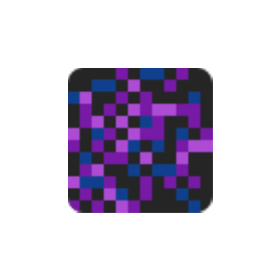

<center><div align="center">



# ObsidianUI

[](https://raw.githubusercontent.com/ThinkingStudios/ObsidianUI/master/LICENSE)


SpruceUI unofficial architectury port.

A Minecraft mod API which adds some GUI utilities.


</div></center>


## Build

Just do `./gradlew build` and everything should build just fine!

## Use inside a mod

You can look at the [fabric-testmod](https://github.com/ThinkingStudios/ObsidianUI/tree/1.21-architectury/test-fabric)/[neoforge-testmod](https://github.com/ThinkingStudios/ObsidianUI/tree/1.21-architectury/test-neoforge) for examples of use.

### Import inside a project

Add this to your `build.gradle` in addition of the base mod `build.gradle`:

```groovy
repositories {
    maven { url = "https://api.modrinth.com/maven" }
}

dependencies {
    include modImplementation("maven.modrinth:obsidianui:${project.obsidianui_version}-${modloader}")
}
```

And this to your `gradle.properties`:

```properties
obsidianui_version=0.2.6+1.21
```
